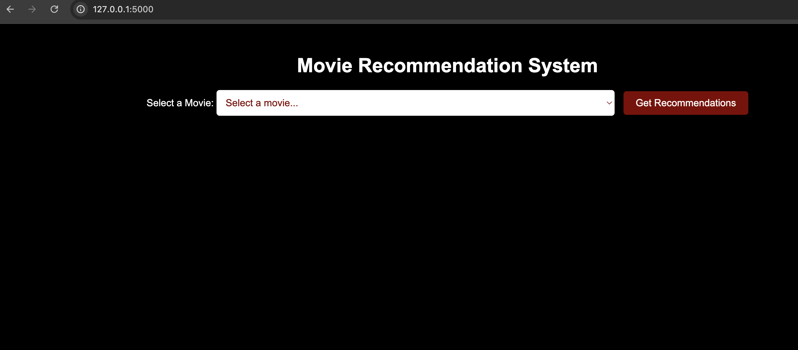
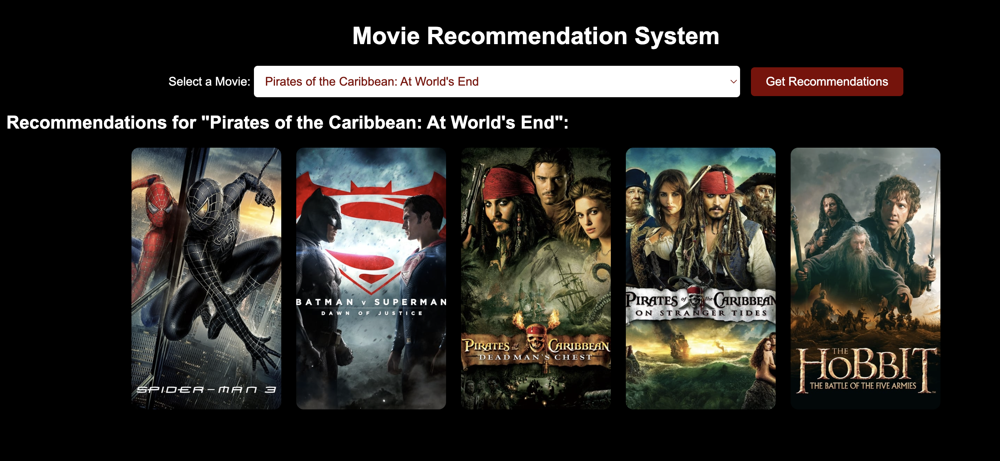
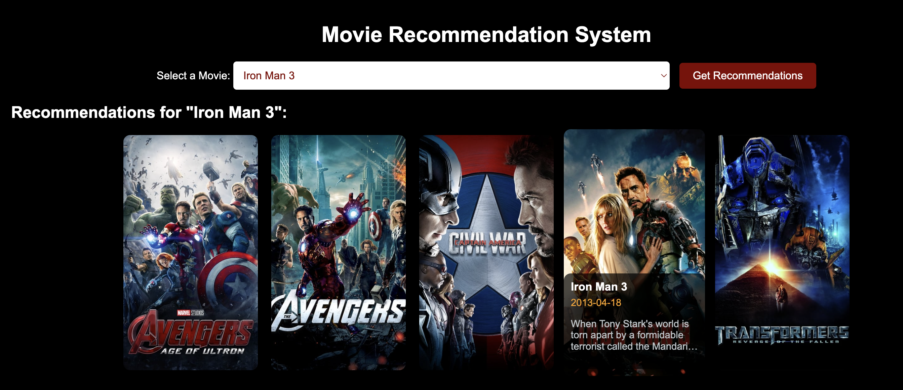

# **Movie Recommendation System 🎬✨**

A Movie Recommendation System built using Flask, Python, and The Movie Database API (TMDb) that allows users to search for movies, get movie recommendations, and view additional movie details such as title, overview, release date, and posters.

# Features 🌟

- Movie Search 🔍: Users can search for movies by title.
- Movie Recommendations 🎥: Based on the selected movie, the system recommends similar movies.
- Movie Details 📝: Displays movie information such as the title, overview, release date, and poster.
- Language Selection 🌐: Filter movies based on languages such as English, Hindi, Tamil, Telugu, and more.
- Genre Filtering 🎭: Filter movies by genre.

# Technologies Used ⚙️

- Python 🐍: Programming language used for the back-end.
- Flask 🌐: Web framework for building the app.
- Pickle 🥒: Serialization of movie data and similarity matrix.
- Requests 🌐: Fetches movie data from The Movie Database API (TMDb).
- Pandas 📊: For handling the movie dataset.
- Scikit-learn 🔍: For calculating cosine similarity between movies based on genre.
- HTML/CSS 🖥️: For front-end development and styling.

## Screenshots 📸

### 1. **Movie Search and Selection**

### 2. **Movie Recommendations**

### 3. **Movie Details and Posters**

When the cursor hovers over a movie poster, it displays additional details about the movie, including the title, release date, year, and a brief description as shpwn on the Iron man 3 poster.

# How It Works ⚙️

- **Preprocess Movie Data**: The movie list and similarity matrix are generated and saved as pickle files using the `pickle.py` script.
- **Flask App**: The app (`app.py`) handles the routing and logic, providing search functionality, movie recommendations, and fetching movie details from the TMDb API.
- **Cosine Similarity**: The app uses cosine similarity to recommend movies based on the genre similarity with the selected movie.
- **Movie Details**: Additional movie details (such as posters and overview) are fetched from the TMDb API.

# Troubleshooting ⚠️

- **Movie not found**: If the movie is not in the list, try searching using different keywords or check for spelling errors.
- **API Issues**: Make sure the API key is correctly set in the `app.py` file and that TMDb is accessible.
- **Network Errors**: Ensure that you have an active internet connection as movie data is fetched online.